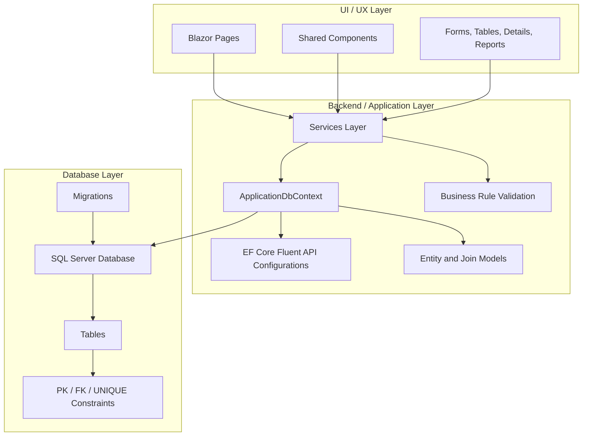

# Sports Event Management Platform  
## Project Setup Plan, Initial Implementation, Minimal Codebase Hierarchy, and ADL

## 1. Locked Technology Stack

The project will be implemented using the following stack:

- **ASP.NET Core Blazor Web App**
- **C#**
- **Entity Framework Core**
- **SQL Server**
- **Bootstrap** for baseline styling
- Optional lightweight Blazor component enhancements later if needed

This stack was selected because it supports online hosting, aligns with the modern direction of the ASP.NET ecosystem, and provides a strong balance between maintainability, full-stack integration, and development speed.

---

## 2. Project Goal for v1

The goal of version 1 is to deliver a hosted sports event management web platform that supports:

- managing venues
- managing locker rooms and vendor booths by venue
- managing teams, vendors, and attendees
- creating events
- assigning teams, vendors, and attendees to events
- assigning locker rooms to teams for events
- assigning booths to vendors for events
- viewing event summaries and assignments

This is the MVP scope and should be completed end-to-end before any major scope expansion.

---

## 3. Locked Implementation Architecture

The project will follow a **single-project, low-overhead architecture**.

### Final implementation choice
- **ASP.NET Core Blazor Web App**
- **EF Core**
- **SQL Server**
- **Single web project**
- **Explicit entity and join classes**
- **Fluent API for keys, relationships, and uniqueness constraints**
- **CRUD-first MVP approach**
- **Hosted online deployment target**

The implementation will avoid unnecessary complexity such as multi-project clean architecture, repository over-abstraction, or premature client-side optimization.

---

## 4. Project Setup Plan and Initial Implementation

The application will be implemented as a **single web project** containing the Blazor UI, the EF Core data model, and the application services. This avoids unnecessary complexity and keeps the codebase easier to manage during early development. Entity Framework Core will be used to define the database schema through model classes and migrations, while SQL Server will store the relational data defined in the logical design.

The core data model will include the main entities `Team`, `Vendor`, `Attendee`, `Venue`, `LockerRoom`, `VendorBooth`, and `Event`, along with the relationship entities `ParticipatesIn`, `SuppliesAt`, `RegistersFor`, `TeamAssignment`, and `VendorAssignment`. These relationship entities will be implemented explicitly rather than using implicit many-to-many shortcuts, since the system must enforce event-specific constraints and support assignment logic clearly.

The application will use EF Core Fluent API to define composite primary keys, foreign keys, and unique constraints. This includes composite keys for participation, registration, and assignment relations, as well as unique constraints on room numbers and booth numbers within a venue, and unique locker room and booth assignments within a given event.

The first phase of implementation will establish the project structure, database context, entity classes, migrations, and core CRUD interfaces for venues, teams, vendors, attendees, and events. The second phase will add management of locker rooms and vendor booths, followed by event participation and attendee registration workflows. The third phase will implement team locker room assignments and vendor booth assignments, along with validation logic to ensure that assignments match the event venue and do not violate uniqueness constraints.

The MVP will support the core operations required by the system: managing venues and their resources, creating and managing teams, vendors, attendees, and events, registering participation in events, assigning spaces to participants, and viewing event-specific summaries. Development will prioritize correctness, relational integrity, and a clean hosted web experience over advanced UI complexity.

---

## 5. Minimal Project / Codebase Hierarchy

Below is the recommended minimal codebase structure for the project.

```text
SportsEventManagement.sln
└── SportsEventManagement.Web/
    ├── Components/
    │   ├── Layout/
    │   │   ├── MainLayout.razor
    │   │   ├── NavMenu.razor
    │   │   └── ...
    │   ├── Shared/
    │   │   ├── ConfirmDeleteDialog.razor
    │   │   ├── ValidationSummaryPanel.razor
    │   │   ├── EntityTable.razor
    │   │   └── ...
    │   └── App.razor
    │
    ├── Pages/
    │   ├── Home.razor
    │   ├── Teams/
    │   │   ├── TeamList.razor
    │   │   ├── TeamCreate.razor
    │   │   ├── TeamEdit.razor
    │   │   └── TeamDetails.razor
    │   ├── Vendors/
    │   │   ├── VendorList.razor
    │   │   ├── VendorCreate.razor
    │   │   ├── VendorEdit.razor
    │   │   └── VendorDetails.razor
    │   ├── Attendees/
    │   │   ├── AttendeeList.razor
    │   │   ├── AttendeeCreate.razor
    │   │   ├── AttendeeEdit.razor
    │   │   └── AttendeeDetails.razor
    │   ├── Venues/
    │   │   ├── VenueList.razor
    │   │   ├── VenueCreate.razor
    │   │   ├── VenueEdit.razor
    │   │   ├── VenueDetails.razor
    │   │   ├── LockerRoomManage.razor
    │   │   └── VendorBoothManage.razor
    │   ├── Events/
    │   │   ├── EventList.razor
    │   │   ├── EventCreate.razor
    │   │   ├── EventEdit.razor
    │   │   ├── EventDetails.razor
    │   │   ├── ManageTeams.razor
    │   │   ├── ManageVendors.razor
    │   │   ├── ManageRegistrations.razor
    │   │   ├── ManageTeamAssignments.razor
    │   │   └── ManageVendorAssignments.razor
    │   └── Reports/
    │       ├── EventSummary.razor
    │       ├── VenueEvents.razor
    │       └── ...
    │
    ├── Models/
    │   ├── Team.cs
    │   ├── Vendor.cs
    │   ├── Attendee.cs
    │   ├── Venue.cs
    │   ├── LockerRoom.cs
    │   ├── VendorBooth.cs
    │   ├── Event.cs
    │   ├── ParticipatesIn.cs
    │   ├── SuppliesAt.cs
    │   ├── RegistersFor.cs
    │   ├── TeamAssignment.cs
    │   └── VendorAssignment.cs
    │
    ├── Data/
    │   ├── ApplicationDbContext.cs
    │   ├── Configurations/
    │   │   ├── TeamConfiguration.cs
    │   │   ├── VendorConfiguration.cs
    │   │   ├── AttendeeConfiguration.cs
    │   │   ├── VenueConfiguration.cs
    │   │   ├── LockerRoomConfiguration.cs
    │   │   ├── VendorBoothConfiguration.cs
    │   │   ├── EventConfiguration.cs
    │   │   ├── ParticipatesInConfiguration.cs
    │   │   ├── SuppliesAtConfiguration.cs
    │   │   ├── RegistersForConfiguration.cs
    │   │   ├── TeamAssignmentConfiguration.cs
    │   │   └── VendorAssignmentConfiguration.cs
    │   ├── Migrations/
    │   └── Seed/
    │       └── DbSeeder.cs
    │
    ├── Services/
    │   ├── TeamService.cs
    │   ├── VendorService.cs
    │   ├── AttendeeService.cs
    │   ├── VenueService.cs
    │   ├── EventService.cs
    │   ├── ParticipationService.cs
    │   └── AssignmentService.cs
    │
    ├── Dtos/ or ViewModels/
    │   ├── TeamFormModel.cs
    │   ├── VendorFormModel.cs
    │   ├── EventFormModel.cs
    │   ├── TeamAssignmentFormModel.cs
    │   └── ...
    │
    ├── wwwroot/
    │   ├── css/
    │   ├── js/
    │   ├── images/
    │   └── ...
    │
    ├── appsettings.json
    ├── appsettings.Development.json
    ├── Program.cs
    └── SportsEventManagement.Web.csproj
```

### Why this hierarchy is the right minimum
- It keeps the project **single-solution and single-web-project**.
- It cleanly separates **UI pages/components**, **domain/data models**, **EF Core configuration**, and **business services**.
- It stays small enough for a 3-week project, while still leaving room for clean growth.

---

## 6. Core Data Model Implementation Plan

The following entity classes will be implemented first:

- `Team`
- `Vendor`
- `Attendee`
- `Venue`
- `LockerRoom`
- `VendorBooth`
- `Event`
- `ParticipatesIn`
- `SuppliesAt`
- `RegistersFor`
- `TeamAssignment`
- `VendorAssignment`

### Why explicit join entities are required
The participation, registration, and assignment relations should be modeled as explicit classes rather than hidden many-to-many shortcuts because:

- the project report already models them explicitly
- assignment constraints are easier to enforce
- the database mapping is easier to explain
- event-specific validation becomes simpler
- the resulting code more closely matches the ER and logical design

---

## 7. EF Core Configuration Plan

Entity Framework Core will be configured using:
- data annotations where useful for simple required fields
- Fluent API for all important relational constraints

### Must be configured in Fluent API

#### Composite primary keys
- `ParticipatesIn(team_id, event_id)`
- `SuppliesAt(vendor_id, event_id)`
- `RegistersFor(attendee_id, event_id)`
- `TeamAssignment(team_id, event_id)`
- `VendorAssignment(vendor_id, event_id)`

#### Foreign keys
- `Event -> Venue`
- `LockerRoom -> Venue`
- `VendorBooth -> Venue`
- all join and assignment tables to their related entities

#### Unique constraints
- `(venue_id, room_number)` unique
- `(venue_id, booth_number)` unique
- `(event_id, locker_room_id)` unique
- `(event_id, booth_id)` unique

These constraints are mandatory because they preserve the formal rules defined earlier in the project.

---

## 8. Business Rules to Enforce in Code

The following rules must be enforced not only at the database level, but also in application logic:

- a locker room assigned to an event must belong to that event’s venue
- a booth assigned to an event must belong to that event’s venue
- a team must already participate in an event before receiving a locker room assignment
- a vendor must already supply at an event before receiving a booth assignment
- duplicate event participation and duplicate attendee registration must be blocked
- duplicate locker room or booth use in the same event must be blocked

These rules should be checked in the service layer before save operations are executed.

---

## 9. Minimal Service Layer Plan

A thin service layer should be used to keep page components clean and centralize business rules.

### Services to create
- `VenueService`
- `TeamService`
- `VendorService`
- `AttendeeService`
- `EventService`
- `ParticipationService`
- `AssignmentService`

### Service responsibilities
- database interaction through `ApplicationDbContext`
- validation and business rule enforcement
- returning success/failure results to the UI
- preparing data needed for page-level operations

### What to avoid
- unnecessary repository abstractions
- deep layered architecture
- generic service patterns that add little value

EF Core already acts as the primary data-access mechanism.

---

## 10. UI / Page Plan

### Main navigation
The top-level navigation should provide access to:

- Dashboard
- Venues
- Teams
- Vendors
- Attendees
- Events
- Reports

### Main feature pages

#### Venues
- venue list
- create venue
- edit venue
- venue details
- manage locker rooms
- manage vendor booths

#### Teams
- team list
- create/edit/delete
- team details

#### Vendors
- vendor list
- create/edit/delete
- vendor details

#### Attendees
- attendee list
- create/edit/delete
- attendee details

#### Events
- event list
- create/edit/delete
- event details

#### Event workflows
- add/remove teams from event
- add/remove vendors from event
- register/unregister attendees
- assign locker room to team
- assign booth to vendor

#### Reporting views
- teams in an event
- vendors in an event
- attendees in an event
- attendee count for event
- events by venue
- team assignment summary
- vendor assignment summary

---

## 11. Recommended Build Order

### Phase 1: Foundation
- create solution and Blazor Web App
- add EF Core and SQL Server packages
- configure connection string
- create entity classes
- create `ApplicationDbContext`
- configure Fluent API
- generate initial migration
- create database
- build shared layout and navigation
- implement CRUD for:
  - Venue
  - Team
  - Vendor
  - Attendee
  - Event

### Phase 2: Venue resources and participation
- implement LockerRoom management
- implement VendorBooth management
- implement team participation in events
- implement vendor participation in events
- implement attendee registration
- implement event details page

### Phase 3: Assignments and polish
- implement team locker room assignment
- implement vendor booth assignment
- enforce semantic validation rules
- add summary/report views
- seed sample data
- prepare hosting deployment
- test and fix bugs

---

## 12. Week-by-Week Implementation Plan

### Week 1
Goal: project skeleton, data model, and base CRUD

- create Blazor Web App
- add EF Core packages
- configure SQL Server connection string
- build entity classes
- configure `ApplicationDbContext`
- configure composite keys and uniqueness rules
- generate initial migration
- update database
- build layout and navigation
- implement CRUD for:
  - Venue
  - Team
  - Vendor
  - Attendee
  - Event

### Week 2
Goal: venue resources and event participation

- implement LockerRoom pages
- implement VendorBooth pages
- implement team-event participation
- implement vendor-event participation
- implement attendee registration
- implement event details pages
- display event summaries and lists

### Week 3
Goal: assignments, polishing, and deployment

- implement locker room assignment workflow
- implement booth assignment workflow
- add validation logic and user feedback
- add development seed data
- polish styling and layout
- test online hosting
- fix bugs and prepare demo flow

---

## 13. Immediate Coding Checklist

The kickoff coding sequence should be:

1. Create the Blazor Web App project
2. Add SQL Server and EF Core package references
3. Create `ApplicationDbContext`
4. Create all entity and join classes
5. Configure all keys, foreign keys, and unique constraints
6. Generate the initial migration
7. Create and verify the database
8. Build navigation and layout
9. Build CRUD pages for Venue, Team, Vendor, Attendee, and Event

This is the best order for minimizing integration problems.

---

# 14. ADL — Architecture Design / Description

## 14.1 Purpose

This ADL documents the system architecture for the Sports Event Management Platform across its three main layers:

- **UI/UX layer**
- **Backend / application layer**
- **Database layer**

The purpose of this architecture is to support a low-overhead, maintainable, hosted web system that cleanly reflects the relational model designed earlier in the project.

---

## 14.2 Architectural Style

The system follows a **three-layer web application architecture**:

1. **Presentation Layer (UI/UX)**
2. **Application / Backend Layer**
3. **Persistence / Database Layer**

This architecture is intentionally simple. It avoids unnecessary complexity while clearly separating user interaction, business logic, and persistent storage.

---

## 14.3 Layer Descriptions

### A. UI/UX Layer
The UI/UX layer is implemented with **Blazor components and pages**. It is responsible for:

- rendering lists, forms, details pages, and summaries
- accepting user input
- displaying validation and feedback messages
- invoking backend services to perform operations

Main contents:
- `Pages/`
- `Components/`
- shared layout/navigation components

The UI layer should not directly implement database rules. Instead, it calls services and displays results.

---

### B. Backend / Application Layer
The backend layer is responsible for:

- coordinating CRUD operations
- validating business rules
- enforcing event-specific assignment logic
- interacting with EF Core and the database
- preparing results for the UI

Main contents:
- `Services/`
- `ApplicationDbContext`
- EF Core model configuration

The backend is intentionally thin. EF Core handles relational persistence, while services provide focused application logic such as assignment validation and participation checks.

---

### C. Database Layer
The database layer is implemented with **SQL Server** and accessed through **Entity Framework Core**.

It is responsible for:
- storing all persistent data
- enforcing primary keys
- enforcing foreign keys
- enforcing uniqueness constraints
- preserving referential integrity

Main contents:
- SQL Server database
- EF Core migrations
- relational tables generated from entity definitions and Fluent API configuration

This layer directly reflects the logical design and relational schema derived from the ER model.

---

## 14.4 Main Data Flow

A typical operation follows this sequence:

1. The user interacts with a Blazor page or form.
2. The UI calls the appropriate application service.
3. The service validates business rules.
4. The service uses `ApplicationDbContext` to query or update data.
5. EF Core sends the corresponding SQL operations to SQL Server.
6. Results are returned back through the service to the UI.
7. The UI updates the page and displays success, failure, or validation feedback.

---

## 14.5 Architectural Decisions

### Decision 1: Single-project architecture
The project uses a single Blazor Web App project instead of a multi-project clean architecture.

**Reason:** lower overhead, faster setup, and easier team coordination for a short timeline.

### Decision 2: Explicit join entities
Participation, registration, and assignment relations are implemented as explicit entity classes.

**Reason:** they carry important constraints and align directly with the logical design.

### Decision 3: EF Core Fluent API for schema rules
Composite keys and uniqueness constraints are configured through Fluent API.

**Reason:** this is the most reliable way to preserve relational constraints in code.

### Decision 4: Thin service layer
Services are used only where business logic or validation would otherwise clutter UI code.

**Reason:** keeps the architecture clean without over-engineering.

### Decision 5: SQL Server as persistence layer
The project uses SQL Server as the database backend.

**Reason:** strong relational support, straightforward EF Core integration, and good alignment with the chosen ASP.NET stack.

---

## 14.6 Architecture Constraints

The architecture must preserve the following system-level constraints:

- every event is associated with exactly one venue
- every locker room belongs to exactly one venue
- every vendor booth belongs to exactly one venue
- room numbers are unique within a venue
- booth numbers are unique within a venue
- locker room assignments are unique within an event
- booth assignments are unique within an event
- event assignments must match the venue hosting the event

These constraints are split across:
- database schema rules
- EF Core configuration
- application service validation

---

## 14.7 Architecture Diagram

The following Mermaid diagram shows the architecture across the UI/UX, backend, and database layers.



---

## 14.8 Optional Higher-Level Component View

If a more system-oriented component view is needed, the following can also be used.


---

## 14.9 Summary

The selected architecture is a low-overhead, three-layer web application design built around a Blazor Web App, EF Core, and SQL Server. It is modern, practical, and closely aligned with the logical database model already developed. The architecture keeps the system simple enough for a short project timeline while still being structured enough to support clear separation of concerns, maintainability, and online hosting.
